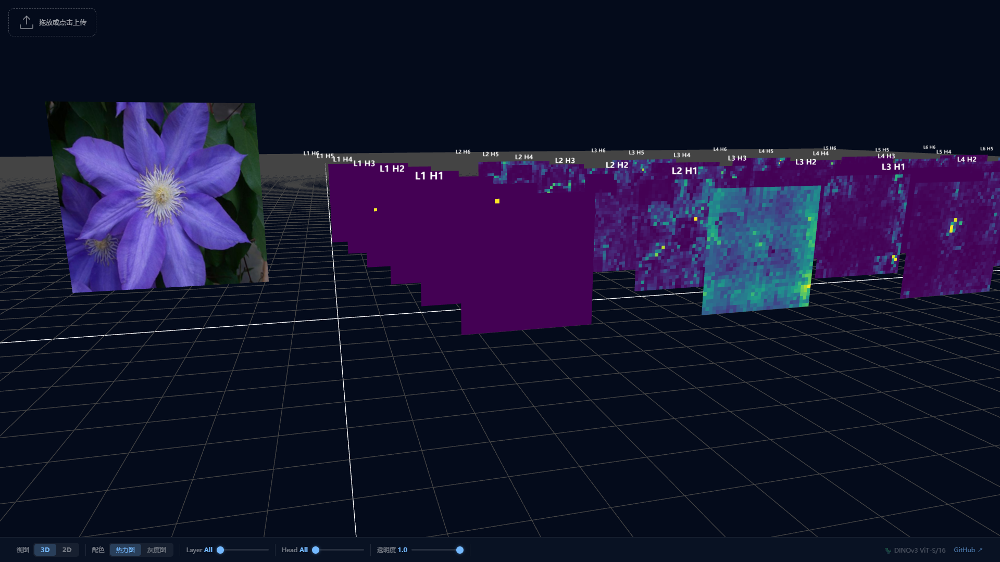
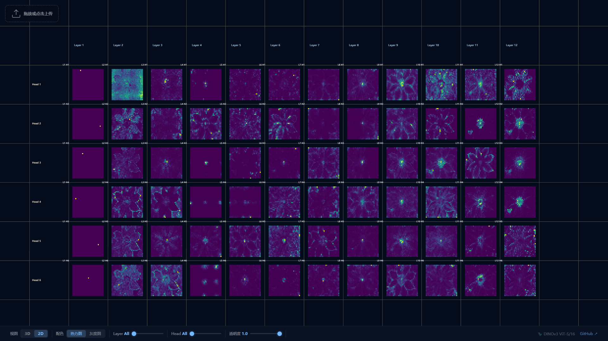

# ViT Attention Visualizer

> 🌐 Language / 语言：**中文** | [English](README_EN.md)

这是一个基于 FastAPI 和 DINOv3 (ViT-S/16) 的自注意力机制 (Self-Attention) 可视化 Web 应用。它可以帮助你直观地观察 Vision Transformer 每一层、每一个 Attention Head 是如何关注图像的不同区域的。

## 🔄 鸣谢与重构说明 (Acknowledgments)

本项目是 Hugging Face Space [webml-community/attention-visualization](https://huggingface.co/spaces/webml-community/attention-visualization) 的重构与优化版本。
原项目基于 **MIT License** 开源。同时，本项目底层的强大视觉特征提取能力由 Meta AI 团队开源的 [DINOv3](https://github.com/facebookresearch/dinov3) 驱动。

我们在原版的基础上针对模型与后端架构进行了以下大幅修改：

- **模型升级**：将原始的可视化模型替换为了拥有更强特征提取能力的 **DINOv3 (ViT-S/16)**。
- **架构重构**：引入了 **FastAPI** 作为后端支撑，提升了 API 接口的速度和稳定性。
- **加载优化**：实现了权重的**完全本地化加载**机制，避免了运行时不可控的在线下载以及 Torch Hub 缓存冲突问题。
- **代码精简**：去除了原模型中大量无需使用的冗余代码，并重新封装了清晰的 Attention 提取 Hook 逻辑。

## 🌟 功能特性


*3D 交互视角下的逐层逐头 Attention 热力图堆叠展示。*


*2D 平铺视角下全局 Attention Head 展示矩阵。*

- **轻量级前端交互**：通过直观的 Web UI 上传图片，支持点击、拖拽操作。
- **逐层/逐头注意力可视化**：自动提取 ViT 中的所有 Head 注意力热力图，并在前端进行渲染展示。
- **完全本地化**：通过挂载钩子 (Forward Hook) 手动提取模型 Attention，并且支持**完全本地加载模型权重**，不依赖网络下载模型。
- **基于 DINOv3**：使用了先进的 DINOv3 ViT-S/16 预训练权重以获得高质量特征与注意力。

## 📂 项目结构

```text
vit-attention-app/
├── app.py                     # FastAPI 后端入口与路由定义
├── model.py                   # 模型加载与 Attention 提取模块 (包含钩子核心逻辑)
├── requirements.txt           # 项目依赖
├── ATTENTION_EXTRACTION.md    # 注意力提取的详细原理解释
├── dinov3/                    # 内置 DINOv3 本地库 (从官方修改去除了冗余代码)
├── static/                    # 静态资源 (CSS, JS)
├── templates/                 # 网页 HTML 模板
└── weights/                   # 本地模型权重存放目录
```

## ⚙️ 环境安装

要求 Python >= 3.11。推荐使用虚拟环境，例如 `venv` 或 `conda`。

```bash
# 克隆仓库
git clone https://github.com/Y-chen3164553757/vit-attention-app.git
cd vit-attention-app

# 安装依赖
pip install -r requirements.txt
```

## ⬇️ 模型权重

项目默认采用**本地权重加载**方式。你需要将预训练模型放在 `weights/` 目录下。

默认寻找的文件路径为：
`weights/dinov3_vits16_pretrain_lvd1689m-08c60483.pth`

如果你在克隆后还没有该权重文件，可以从 DINOv3 的官方发布地址下载对应的 ViT-S/16 (LVD1689M) 模型权重，并保存至 `weights/` 目录下。

## 🚀 启动服务

完成环境安装并确保权重已就位后，使用 uvicorn 启动 Web 应用：

```bash
python app.py
```
或直接运行：
```bash

## 📄 版权说明与开源协议 (License)

本项目前端交互与后端 API 架构的重构代码**保留所有权利 (All Rights Reserved)**，未经授权禁止将其直接用于商业用途或其他二次分发。如需商业合作或软著登记参考，请联系作者。

本项目部分代码继承或修改自开源社区，并在使用时遵循其原有协议：
- 原版灵感与部分可视化参考来源于 Hugging Face Space [webml-community/attention-visualization](https://huggingface.co/spaces/webml-community/attention-visualization)（基于 MIT License）。
- 模型内置的 DINOv3 代码与权重遵循 Meta [DINOv3 License Agreement](https://github.com/facebookresearch/dinov3/blob/main/LICENSE)。
uvicorn app:app --host 127.0.0.1 --port 8080 --reload
```

启动后，打开浏览器访问：[http://127.0.0.1:8080](http://127.0.0.1:8080) ，上传任意图片即可进行自注意力可视化。

## 📝 技术细节

关于 Attention 提取的核心逻辑：通过注册 `register_forward_hook` 在每层 SelfAttention 上拦截输入，利用 `Q` 和 `K` 进行手动计算：

$$
\text{Attention} = \text{softmax}\left(\frac{Q \cdot K^T}{\sqrt{d}}\right)
$$

以此提取 CLS token 对于各个 Patch 的注意力权重，并在后续放大为可视化热力图。

更多详细理论和数学推导请参阅 [ATTENTION_EXTRACTION.md](ATTENTION_EXTRACTION.md)。
